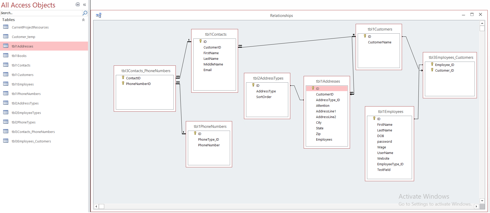
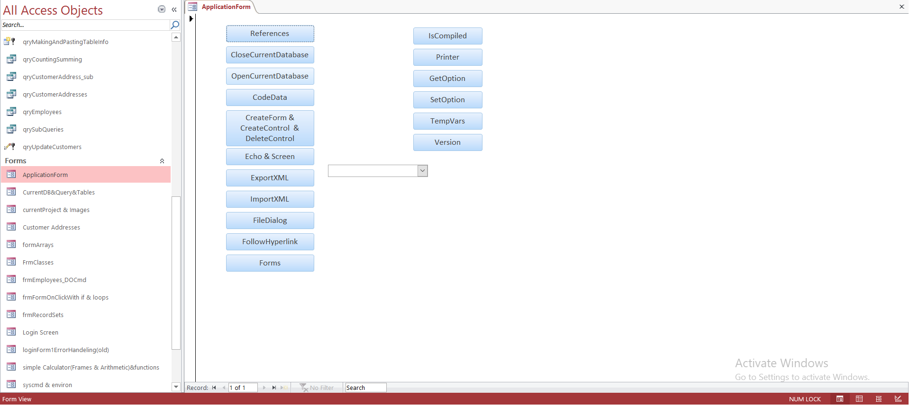
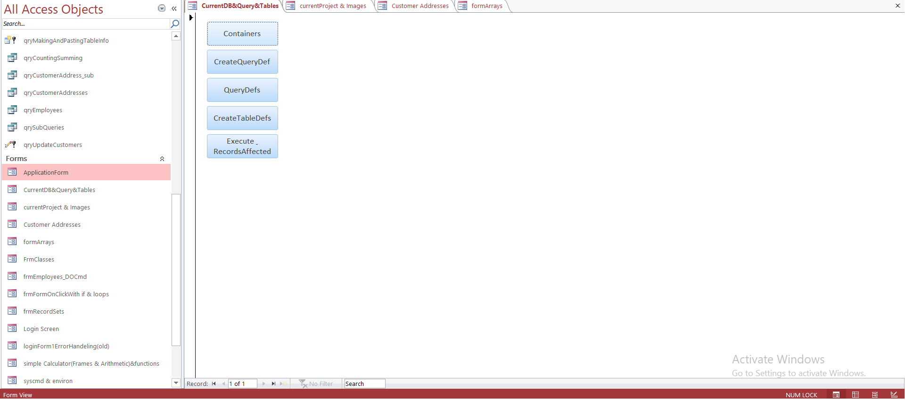
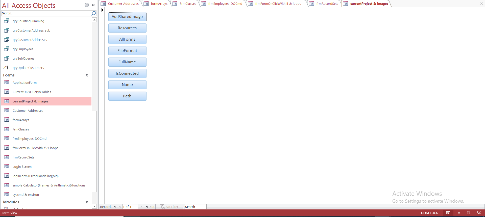
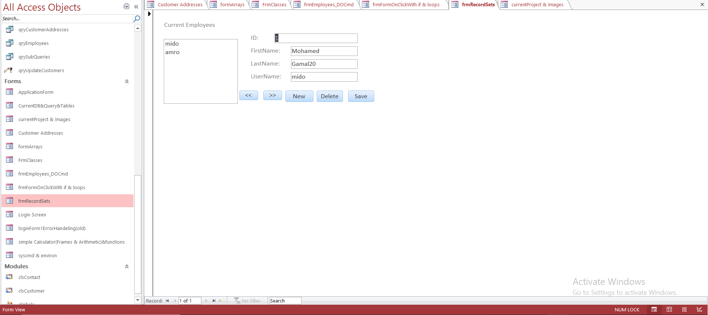
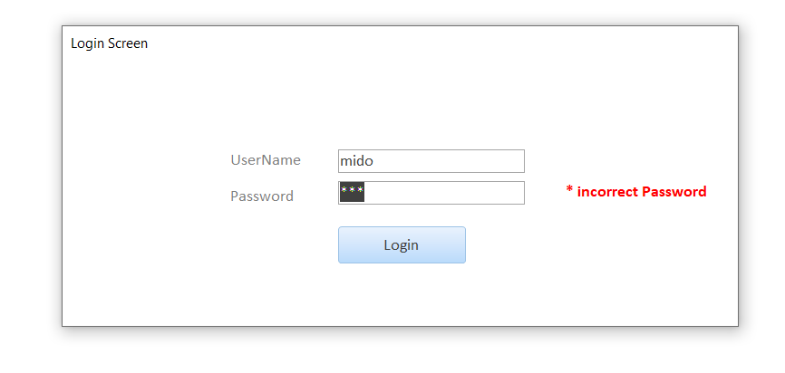

## Customer DB

## Overview
Access projects with VBA are simple projects that illustrate How to create access desktop applications using access VBA with connection to DB for rapied production.

## Table of contents (Forms)

* Front-end Forms (fe file) 
    - **ApplicationForm** 
    - **CurrentDB&Query&Tables**  
    - **CurrentProject & Images**  
    - **Customer Addresses** 
    - **formArrays**
    - **FrmClasses** 
    - **frmEmployeess_DOCmd** 
    - **frmFormOnClickWith if & loops** 
    - **frmRecordSets**
    - **Login Screen**
    - **LoginForm1ErrorHandeling(old)**
    - **simple Calculator(Frames & Arithmetic)&functions**
    - **syscmd & environ**
* Back-end Database (Tables)

## Main Projects
### 1. ApplicationForm

* references button for printing refs
* CloseCurrentDatabase for closing the DB connection
* OpenCurrentDatabase for open an external DB
* CodeData for printing all queries and tables
* CreateForm && CreateControl  && DeleteControl for create and delete forms and control in runtime
* Echo && Screen for freezing and unfreezing mouse clicks
* ExportXML for Exporting file as an xml file
* ImportXML for Importing an xml file as a table in my db
* FileDialog for selecting files from our computer
* FollowHyperlink for opening a website or a file on pc
* Forms for openning a form and controlling its values
* IsCompiled: to see if application is compiled or not
* Printer: to control my connected printers
* GetOption: to access options in options tab in file tab
* SetOption: to set options in optyions tab in file tab.
* TempVars: setting and getting temporary variables used to store temp info between forms.
* Version: to get application version

### 2. CurrentDB&Query&Tables

* Containers button for printing containers
* CreateQueryDef for creating a query
* QueryDefs for creating a query in another way
* CreateTableDefs for creating tables with fields.
* Execute & RecordsAffected for Executing queries on our database.

### 3. CurrentProject & Images

* AddSharedImage button for adding image to image frame
* Resources for controlling or deleting our resources
* AllForms for printing our all forms
* FileFormat for getting file format.
* FullName for printing the full name of our project
* IsConnected to print if db is connected or not
* Name: print project Name
* Path: print currentProject path

### 4. frmRecordSets
#### A CRUD project for creatng, reading, updating and deleting employees and retreving them one per page using next and previous buttons.

### 5. Login Screen 
#### A login screen with userName and password validation

